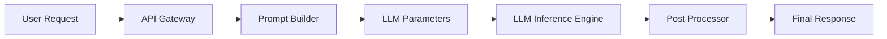
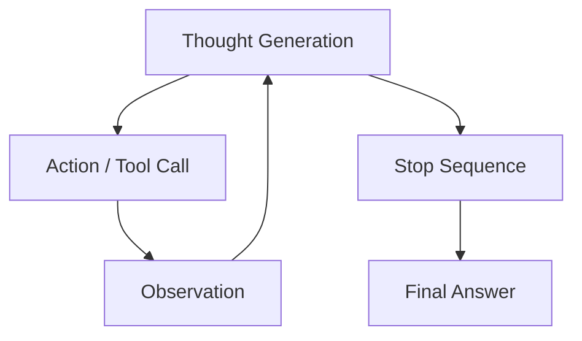
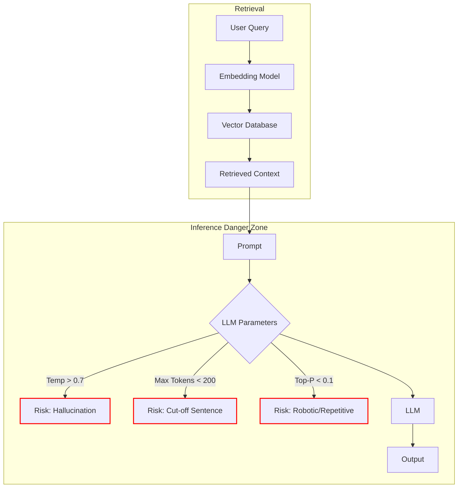
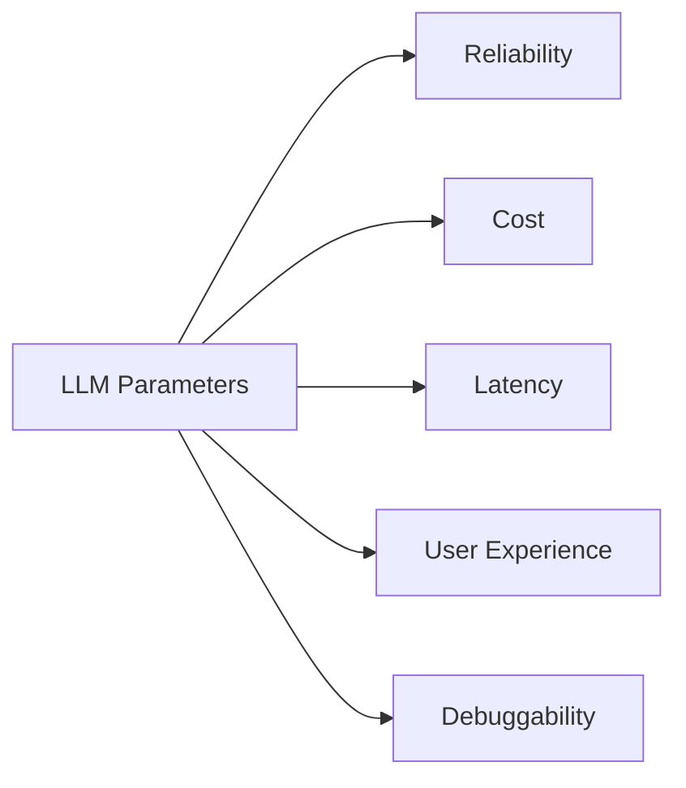

Most engineers treat LLM parameters like prompt-level tweaks — sliders you adjust until the output “looks good.”

That approach works for demos.  
It fails the moment the AI system hits production.

Parameters like **temperature, top-k, top-p, max tokens, penalties, and stop sequences** directly shape **cost, latency, determinism, failure modes, and debuggability**. They decide whether your system is predictable, scalable, and safe — or brittle and expensive.

These are not prompt hacks.  
They are **system design decisions**.

In this article, we break down LLM parameters from a **backend and architecture perspective**, grounded in real-world AI systems such as **RAG pipelines, agents, and production APIs** — the way they actually behave under load, not how they look in notebooks.

---

## Why LLM Parameters Are Not Prompt Tweaks

When an LLM moves from a demo to production, it becomes part of a larger system:

* API gateways
    
* Retrieval pipelines (RAG)
    
* Caching layers
    
* Retry logic
    
* SLAs and cost budgets
    
* Observability and logging
    

LLM parameters sit **inside the inference layer**, shaping how the system behaves under real load.



**Key insight:**  
If you don’t design your parameters intentionally, they will design your system for you.

---

## Temperature: Variance Control, Not Creativity

**Temperature controls output randomness (entropy).**

* **Low temperature (0.0–0.2)** → deterministic, repeatable outputs
    
* **High temperature (0.7+)** → diverse, unpredictable outputs
    

### System-level impact

* In **RAG systems**, high temperature amplifies retrieval noise
    
* In **agents**, high temperature increases reasoning drift
    
* Low temperature exposes flaws in:
    
    * Prompt structure
        
    * Retrieval quality
        
    * Chunking strategy
        

> **Rule:**  
> If your system needs retries, reduce temperature before changing prompts.

---

## Top-K vs Top-P: Control vs Adaptability

### Top-K

Limits the model to the **K most probable tokens**.

* Acts as a **hard guardrail**
    
* Reduces extreme or unsafe outputs
    
* Useful in regulated domains
    

### Top-P (Nucleus Sampling)

Selects tokens until cumulative probability reaches **P**.

* Adaptive and more natural
    
* Better for open-ended responses
    
* Preferred for most production systems
    

### System insight

* **Top-K = safety-first**
    
* **Top-P = flexibility-first**
    

You are choosing a **risk tolerance model**, not a stylistic preference.

---

## Max Tokens: A Cost and Latency Lever

Max tokens defines the **upper bound on output length**.

This parameter directly affects:

* Token cost
    
* P95 and P99 latency
    
* Cache hit rates
    
* Response truncation risks
    

### Production reality

Many teams overspend simply because max tokens is set too high “just in case”.

> **Think of max tokens as a budget constraint, not a formatting option.**

---

## Presence & Frequency Penalties: Conversation Stabilizers

* **Frequency penalty** reduces repeated phrases
    
* **Presence penalty** encourages new topics
    

These parameters are critical for:

* Chat systems
    
* Multi-turn agents
    
* Workflow-based reasoning loops
    

Without them, agents tend to:

* Loop
    
* Repeat tool calls
    
* Rephrase the same idea endlessly
    

---

## Stop Sequences: Output Contracts, Not Formatting Tricks

Stop sequences define **when the model must stop generating**.

They are essential for:

* Structured outputs (JSON, YAML)
    
* Tool invocation
    
* Agent loops
    
* Preventing hallucinated trailing text
    



**Key takeaway:**  
Stop sequences are **contracts between your system and the model**.

---

## Parameter Interaction in RAG Systems

RAG systems are especially sensitive to parameter tuning because retrieval quality and generation quality are tightly coupled.



### What happens in practice

* High temperature + weak retrieval → hallucinations
    
* Low temperature + poor chunking → incomplete answers
    
* Large max tokens → higher latency and cost
    

---

## Parameter Impact Zones

Every parameter change shifts one or more system constraints.



This is why parameter tuning is **backend engineering in disguise**.

---

## Parameter Presets Aligned With Real Use Cases

### 1️⃣ RAG-Based Question Answering

```json
{
  "temperature": 0.1,
  "top_p": 0.9,
  "max_tokens": 512,
  "presence_penalty": 0.0,
  "frequency_penalty": 0.0
}
```

**Why**

* Deterministic answers
    
* Minimal hallucination
    
* Retrieval provides factual grounding
    

---

### 2️⃣ AI Agents / Workflow Automation

```json
{
  "temperature": 0.2,
  "top_k": 40,
  "max_tokens": 1024,
  "presence_penalty": 0.6,
  "frequency_penalty": 0.4,
  "stop": ["\nObservation:", "\nFinal Answer:"]
}
```

**Why**

* Prevents looping
    
* Encourages forward progress
    
* Enables structured reasoning
    

---

### 3️⃣ Summarization & Information Extraction

```json
{
  "temperature": 0.0,
  "top_k": 20,
  "max_tokens": 300,
  "stop": ["\n\n"]
}
```

**Why**

* Fully deterministic
    
* Safe for automation
    
* Parser-friendly
    

---

### 4️⃣ Creative Content Generation

```json
{
  "temperature": 0.8,
  "top_p": 0.95,
  "max_tokens": 800,
  "presence_penalty": 0.8
}
```

---

## Framework-Specific Syntax Examples

### OpenAI / Generic REST

```python
client.responses.create(
    model="gpt-4.1",
    input="Explain LLM parameters",
    temperature=0.2,
    top_p=0.9,
    max_output_tokens=512
)
```

---

### LangChain / LangGraph

```python
from langchain.chat_models import ChatOpenAI

llm = ChatOpenAI(
    temperature=0.2,
    top_p=0.9,
    max_tokens=512
)
```

LangGraph node:

```python
graph.add_node(
    "llm_call",
    lambda state: llm.invoke(state["input"])
)
```

---

### AWS Bedrock (Agent / Orchestration Style)

```python
response = bedrock.invoke_model(
    modelId="anthropic.claude-v2",
    body=json.dumps({
        "temperature": 0.2,
        "top_p": 0.9,
        "max_tokens_to_sample": 512
    })
)
```

---

### Microsoft Agent Framework / Semantic Kernel

```python
from semantic_kernel.connectors.ai.open_ai import AzureChatCompletion

kernel.add_service(
    AzureChatCompletion(
        temperature=0.1,
        max_tokens=512,
        top_p=0.9
    )
)
```

---

### Generic Backend Inference Pattern

```python
def call_llm(prompt):
    return llm.generate(
        prompt,
        temperature=0.2,
        top_p=0.9,
        max_tokens=512,
        stop=["\nAction:"]
    )
```

---

## Final Takeaways

LLM parameters are not:

* Prompt tricks
    
* Trial-and-error settings
    
* Cosmetic adjustments
    

They are:

* **Reliability controls**
    
* **Cost governors**
    
* **Latency shapers**
    
* **System design decisions**
    

> **If you don’t design your parameters, your parameters will design your system.**